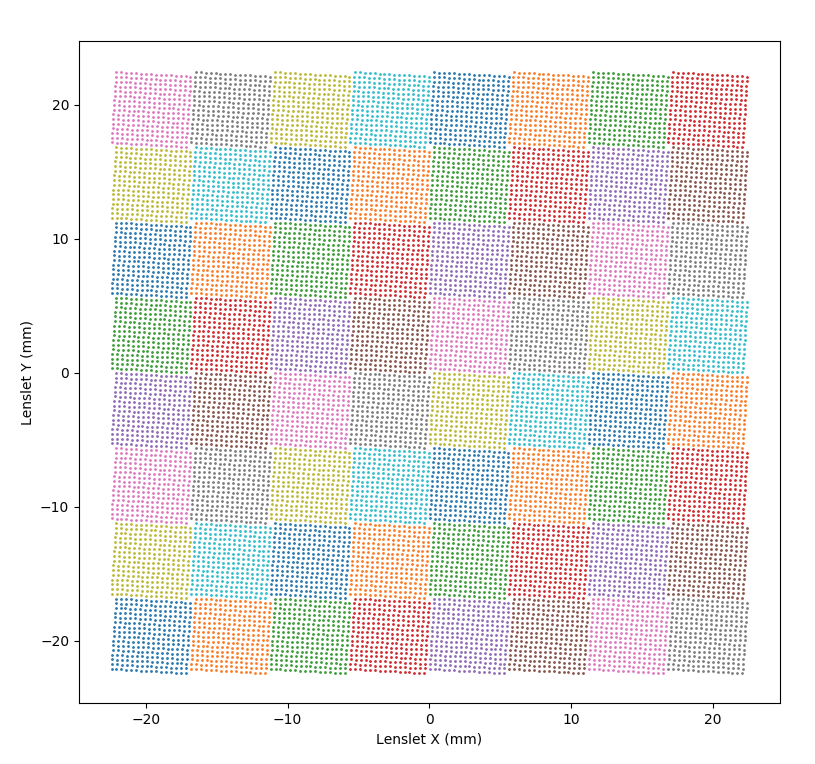

Algorithms
==========

Algorithms to be implemented for the IRIS imager and Integral Field
Spectrograph. Once the actual classes are implemented in
:py:mod:`iris_pipeline`, we will just link their implementations.

Correlated Double Sampling
---------------------------

The master dark is generated by the median of 5-10 individual dark
frames taken at the same exposure. This removes any of the
frame-to-frame noise variation. Individual dark frames are zero
illumination calibration frames with a shutter or blocking filter to not
allow any light to hit the detector.

::

   # 4096x4096 at 100 seconds exposures, N-frames
   # dark1, dark2, dark3, …, darkN
   darks = np.array([dark1, dark2, dark3, darkN])
   master_dark = np.median(darks, axis=0)

Multiple Correlated Double Sampling
-----------------------------------

Each science and calibration frame will have dark current, residual
electric current that is flowing through the array when there is no
light. Dark current increases with time, so all science and calibration
frames need equivalent exposure dark frames. To remove the dark current,
we subtract a single dark in the real-time or a master dark in the final
pipeline, at the same exposure time as the science and calibration
frames.

::

   dark_subtracted_science = science - dark
   dark_subtracted_flat = flat - dark

Up the Ramp 
-----------------------------------

